# Taller Practico — Tecnicas XAI Aplicadas al Aprendizaje Automatico

**Materia:** Aprendizaje Automatico  
**Actividad:** Trabajo Colaborativo — Semana 4  
**Unidad:** Etica, Sesgo y Calidad en el Aprendizaje Automatico

---

## Autores

| Nombre | Rol en el proyecto |
|---|---|
| Madheline Katerine Torres Hallo | Analisis exploratorio, calidad de datos y deteccion de sesgos |
| Carlos Vladimir Ramirez Espinoza | Entrenamiento de modelos y evaluacion comparativa |
| Dennys Francisco Salazar Dominguez | Implementacion de tecnicas XAI y reflexion etica |

---

## Descripcion del Problema

Este proyecto implementa y compara tres modelos de Machine Learning supervisado para predecir fallas en maquinaria industrial, utilizando el dataset publico AI4I 2020 Predictive Maintenance Dataset (10,000 registros, UCI Machine Learning Repository). Se aplican cuatro tecnicas de explicabilidad (XAI) para garantizar transparencia en las decisiones del modelo, detectar sesgos sistematicos y reflexionar sobre los principios eticos del sistema automatizado.

---

## Objetivos

- Implementar y comparar multiples modelos de ML supervisado: Regresion Logistica, Arbol de Decision y Random Forest
- Aplicar cuatro tecnicas XAI para mejorar la transparencia y comprension del modelo
- Detectar y mitigar sesgos en los datos (desbalance de clases, sesgo por tipo de maquina)
- Reflexionar sobre los riesgos eticos de sistemas automatizados de decision en contextos industriales
- Documentar el flujo completo del proyecto de forma reproducible en VS Code

---

## Estructura del Repositorio

```
TrabajoColaborativo-S4/
|
|-- data/
|   `-- ai4i_predictive_maintenance.csv       # Dataset original (UCI)
|
|-- notebooks/
|   `-- xai_predictive_maintenance.ipynb      # Notebook principal ejecutable en VS Code
|
|-- outputs/
|   |-- figures/                              # Visualizaciones generadas al ejecutar el notebook
|   |-- models/                              # Modelos entrenados serializados (.pkl)
|   `-- reports/                             # Reportes de metricas
|
|-- src/
|   `-- utils.py                             # Modulo de funciones auxiliares reutilizables
|
|-- requirements.txt                         # Dependencias del proyecto
|-- .gitignore
`-- README.md
```

---

## Dataset

**AI4I 2020 Predictive Maintenance Dataset — UCI Machine Learning Repository**

| Caracteristica | Detalle |
|---|---|
| Registros | 10,000 |
| Variables | 8 (6 numericas, 1 categorica, 1 objetivo) |
| Variable objetivo | Machine failure (binaria: 0 = sin falla / 1 = falla) |
| Desbalance detectado | 96.6% sin falla — 3.4% con falla |
| Valores nulos | Ninguno |

| Variable | Descripcion | Tipo |
|---|---|---|
| UDI | Identificador unico | Entero |
| Type | Tipo de maquina (L / M / H) | Categorica |
| Air temperature [K] | Temperatura del aire en Kelvin | Numerica |
| Process temperature [K] | Temperatura del proceso en Kelvin | Numerica |
| Rotational speed [rpm] | Velocidad rotacional | Numerica |
| Torque [Nm] | Torque en Newton-metro | Numerica |
| Tool wear [min] | Desgaste de herramienta en minutos | Numerica |
| Machine failure | Variable objetivo: falla (1) / no falla (0) | Binaria |

---

## Flujo del Proyecto

### Paso 1 — Exploracion y Calidad de Datos

Se analiza la distribucion de variables, se detectan valores nulos, duplicados y el desbalance severo de clases (ratio 28:1). Se identifica ademas un posible sesgo sistematico por tipo de maquina.

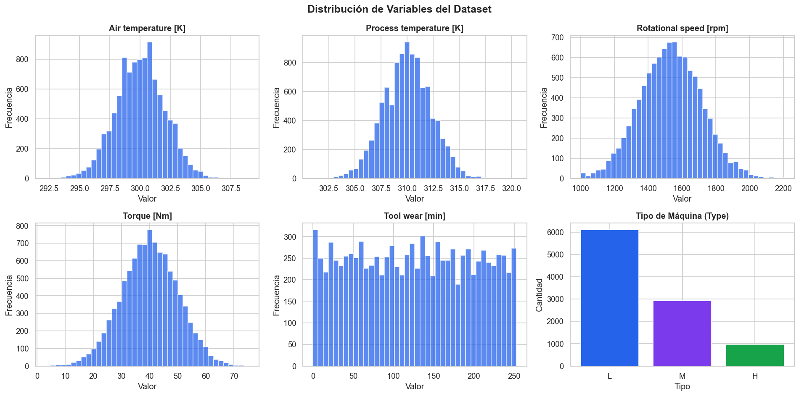

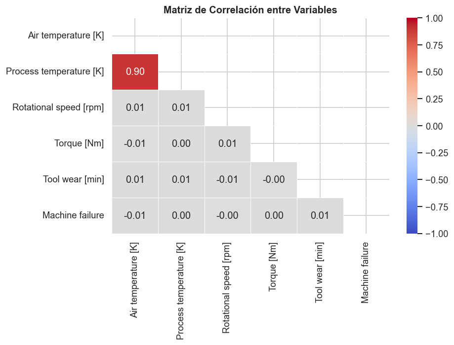

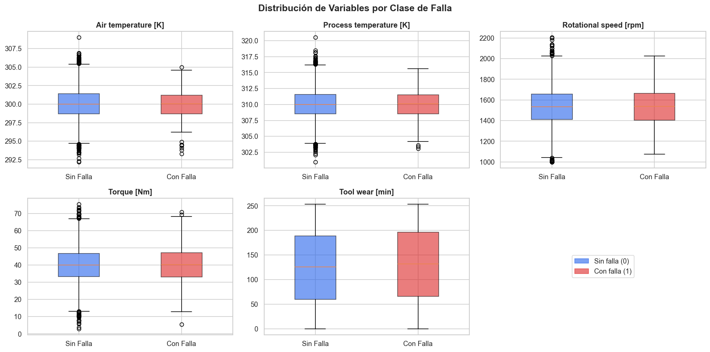

---

### Paso 2 — Deteccion de Sesgo

Se visualiza el desbalance de clases y se analiza la tasa de falla diferenciada por tipo de maquina (L, M, H), identificando un sesgo sistematico que podria afectar la equidad del modelo.

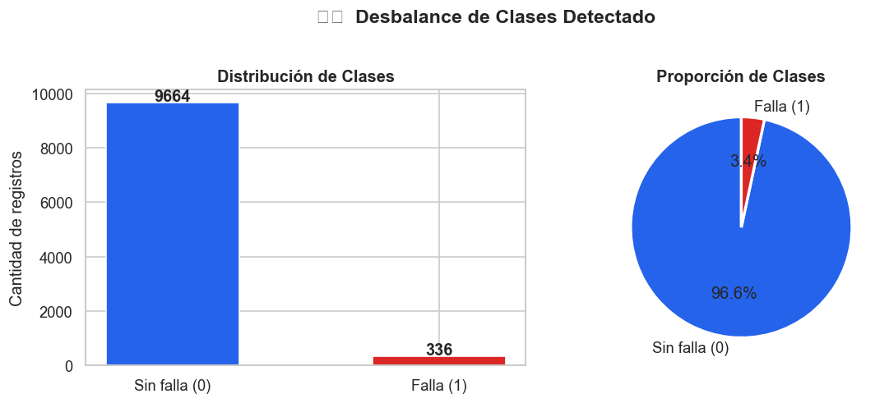

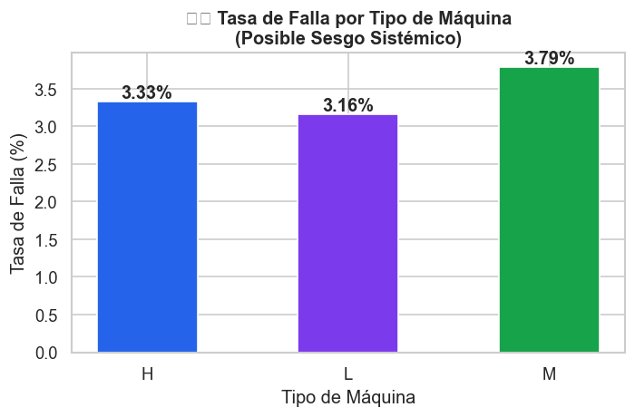

---

### Paso 3 — Mitigacion de Sesgo con SMOTE

El desbalance severo (3.4% de fallas) sesga cualquier modelo hacia predecir siempre "sin falla". Se aplica SMOTE (Synthetic Minority Oversampling Technique) sobre el conjunto de entrenamiento para balancear las clases antes del ajuste de los modelos.

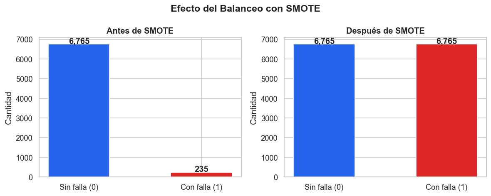

---

### Paso 4 — Modelos Implementados

| Modelo | Rol en el proyecto | Tecnica XAI asociada |
|---|---|---|
| Regresion Logistica | Baseline interpretable | Interpretacion de coeficientes |
| Arbol de Decision | Explicabilidad visual directa | Visualizacion completa del arbol |
| Random Forest | Mayor rendimiento predictivo | SHAP Values + Permutation Importance |

---

### Paso 5 — Evaluacion Comparativa

Se comparan los tres modelos con cinco metricas: Accuracy, Precision, Recall, F1-Score y ROC-AUC. Se prioriza el Recall dado el costo asimetrico del error (una falla no detectada tiene mayor costo que una falsa alarma).

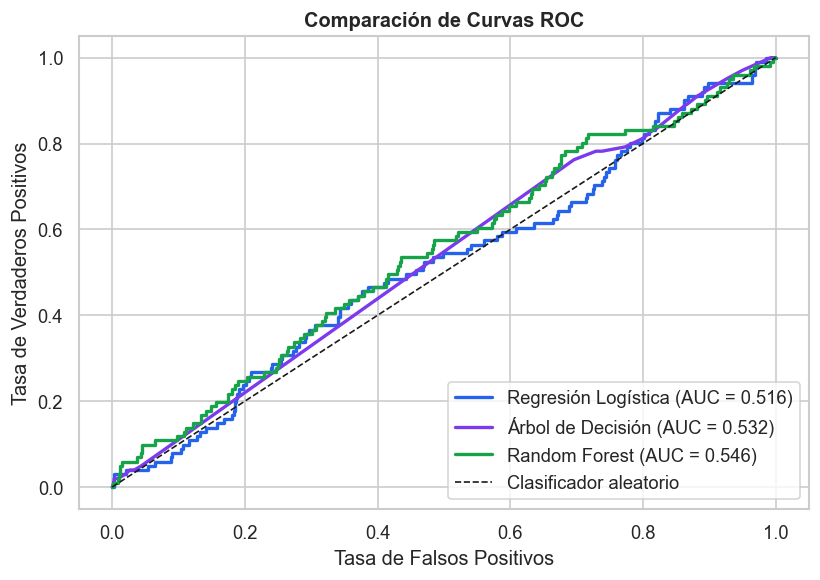

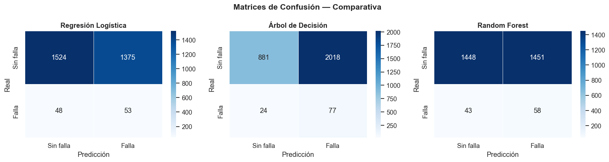

---

## Tecnicas XAI Aplicadas

### XAI 1 — Interpretacion de Coeficientes (Regresion Logistica)

Los coeficientes indican la direccion e intensidad del efecto de cada variable sobre la probabilidad de falla en escala log-odds. Variables con coeficiente positivo aumentan el riesgo; coeficiente negativo lo reducen. Esta tecnica es aplicable directamente sobre el modelo sin herramientas externas.

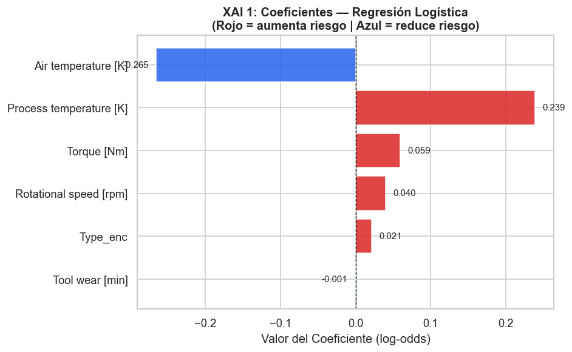

---

### XAI 2 — Visualizacion del Arbol de Decision

El arbol de decision es intrinsecamente interpretable. Cada nodo muestra la condicion de division, el indice Gini, el numero de muestras y la distribucion de clases. Permite trazar el camino exacto que conduce a cada prediccion sin necesidad de tecnicas adicionales.

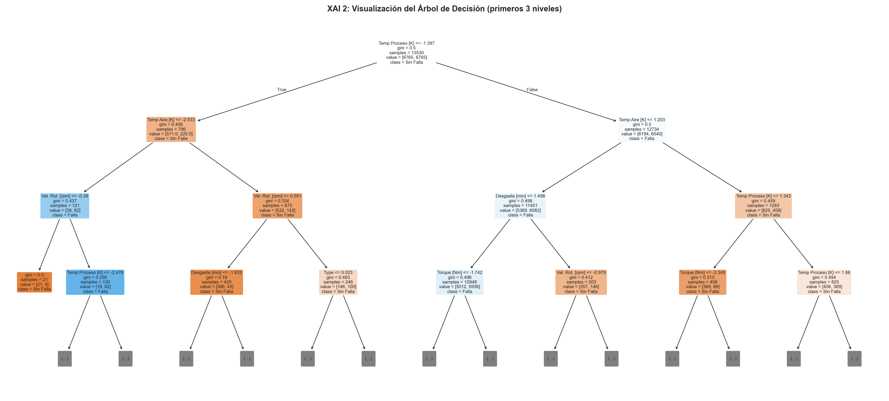

---

### XAI 3 — SHAP Values (Random Forest)

SHAP (SHapley Additive exPlanations) calcula la contribucion marginal de cada variable en cada prediccion individual, fundamentado en la teoria de juegos cooperativos de Lloyd Shapley (1953). El Summary Plot muestra el impacto global sobre el conjunto de prueba; el Bar Plot presenta la importancia media absoluta por variable.

Recurso utilizado: [SHAP Documentation](https://shap.readthedocs.io/en/latest/)

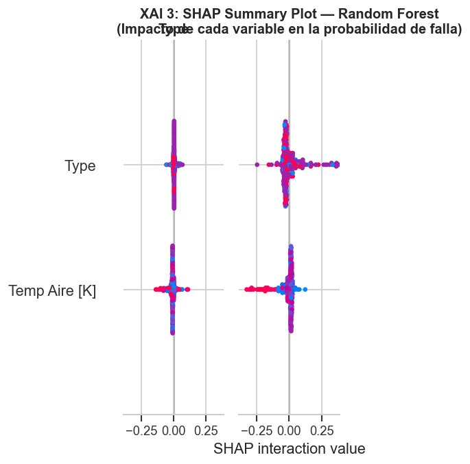

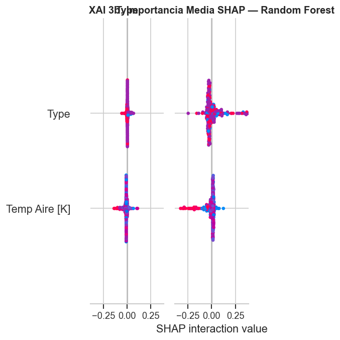

---

### XAI 4 — Permutation Feature Importance (Comparativa entre Modelos)

Mide el descenso en F1-Score al permutar aleatoriamente los valores de cada variable, rompiendo su relacion con la variable objetivo. Permite comparar la importancia de variables entre los tres modelos bajo el mismo criterio de evaluacion.

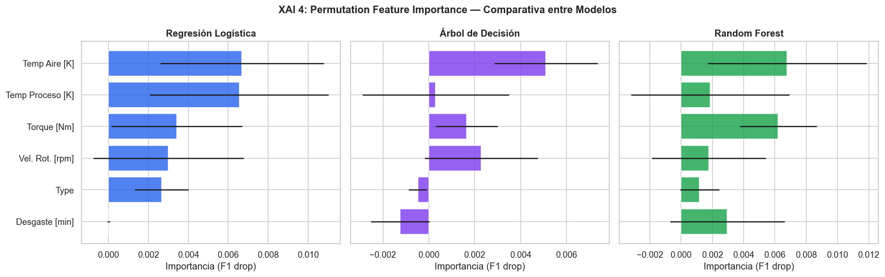

---

## Explicaciones Individuales

Se analizan dos instancias concretas del conjunto de prueba usando SHAP Waterfall Plot para explicar la decision del modelo a nivel individual. Esta capacidad es fundamental para contextos de alto riesgo industrial donde cada decision debe poder auditarse.

**Caso 1 — Prediccion de FALLA (Verdadero Positivo)**

El modelo detecta correctamente una falla. El Waterfall Plot muestra que variables como Torque y Tool wear empujan la prediccion hacia la clase positiva.

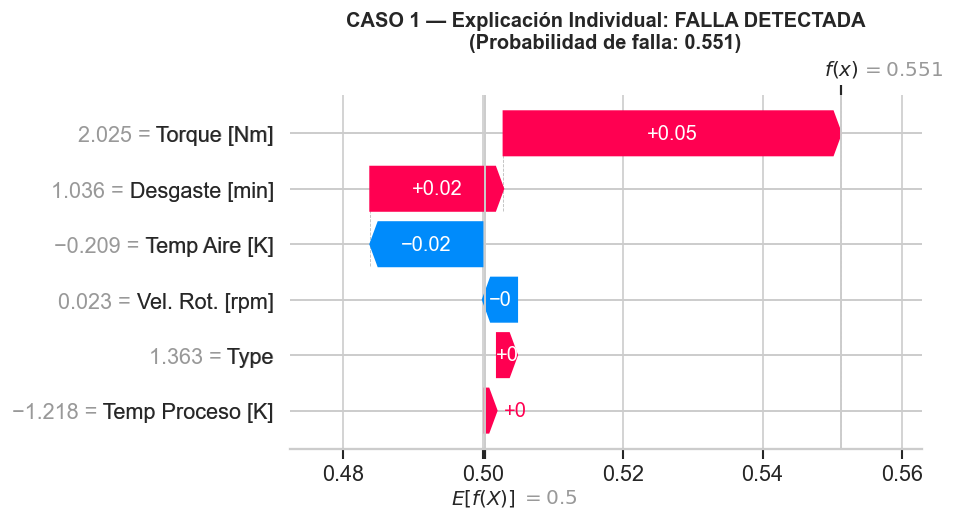

**Caso 2 — Prediccion de SIN FALLA (Verdadero Negativo)**

El modelo descarta correctamente una falla. Las mismas variables contribuyen en sentido contrario, alejando la prediccion de la clase positiva.

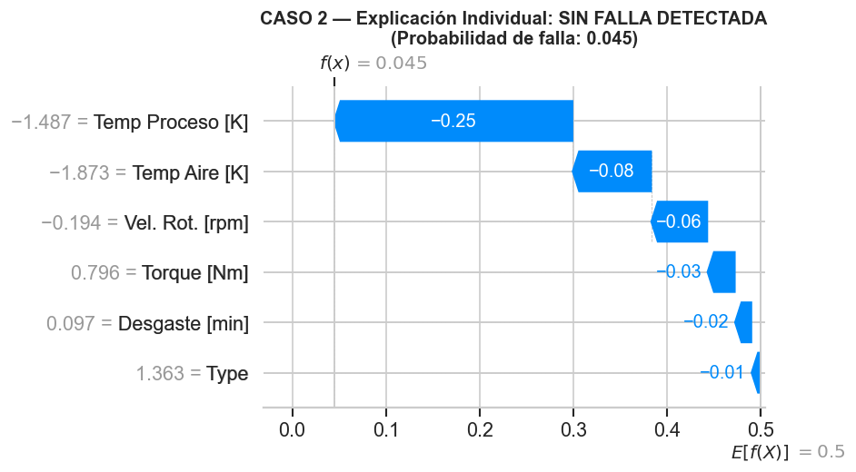

---

## Hallazgos Principales

- Random Forest obtuvo el mejor balance de metricas en todos los indicadores evaluados
- Torque [Nm] y Tool wear [min] son las variables mas influyentes segun todas las tecnicas XAI aplicadas, lo cual es coherente con el conocimiento de dominio en mantenimiento industrial
- Se detecto desbalance severo de clases (ratio 28:1), mitigado con SMOTE antes del entrenamiento
- Se identifico sesgo sistematico por tipo de maquina: distintas tasas de falla entre los tipos L, M y H
- Las cuatro tecnicas XAI son consistentes entre si en la identificacion de variables criticas, lo que valida la robustez del analisis

---

## Reflexion Etica

Si este sistema se implementa en produccion sin explicabilidad, se presentan los siguientes riesgos:

**Opacidad decisional.** Los operadores no pueden cuestionar ni validar las decisiones del sistema, generando dependencia tecnologica ciega sobre un modelo que no pueden entender.

**Sesgo sistematico no detectado.** El modelo trata de forma distinta a los tipos L, M y H de maquina sin que ningun responsable pueda detectarlo ni corregirlo en produccion.

**Costo asimetrico del error.** Un falso negativo (falla no detectada) puede derivar en accidentes industriales o perdidas millonarias. El sistema debe optimizarse priorizando el Recall sobre el Accuracy.

**Accountability difusa.** Sin trazabilidad de decisiones, la responsabilidad legal y etica ante un fallo del sistema queda sin asignar entre los equipos tecnicos y la organizacion.

**Overreliance.** Los equipos de mantenimiento podrian dejar de aplicar su criterio y experiencia, delegando decisiones criticas al modelo sin cuestionarlo.

Recomendaciones para una implementacion responsable:
- Optimizar el umbral de clasificacion hacia mayor Recall (0.3-0.4) dado el costo asimetrico
- Incorporar datos de series temporales para capturar degradacion progresiva de la maquinaria
- Establecer auditoria humana obligatoria para decisiones de alto impacto
- Monitorear el modelo en produccion ante posible concept drift
- Documentar y comunicar los sesgos detectados antes de cualquier despliegue productivo

---

## Recursos de Apoyo Utilizados

| Recurso | Uso en el proyecto |
|---|---|
| [SHAP Documentation](https://shap.readthedocs.io/en/latest/) | TreeExplainer, Summary Plot, Waterfall Plot, Bar Plot — XAI 3 |
| [scikit-learn — Permutation Importance](https://scikit-learn.org/stable/modules/permutation_importance.html) | XAI 4 — comparativa entre los tres modelos |
| [imbalanced-learn — SMOTE](https://imbalanced-learn.org/stable/references/generated/imblearn.over_sampling.SMOTE.html) | Mitigacion del desbalance severo de clases |
| [UCI ML Repository — AI4I Dataset](https://archive.ics.uci.edu/ml/datasets/AI4I+2020+Predictive+Maintenance+Dataset) | Dataset base del proyecto |

---

## Instalacion y Ejecucion

### 1. Clonar el repositorio

```bash
git clone https://github.com/dfsd0001/TrabajoColaborativo-S4.git
cd TrabajoColaborativo-S4
```

### 2. Crear entorno virtual

```bash
python -m venv venv

# Windows
venv\Scripts\activate

# Linux / macOS
source venv/bin/activate
```

### 3. Instalar dependencias

```bash
pip install -r requirements.txt
```

### 4. Abrir el notebook en VS Code

```bash
code notebooks/xai_predictive_maintenance.ipynb
```

Requiere la extension Jupyter instalada en VS Code. Seleccionar el kernel del entorno virtual creado. Al ejecutar el notebook completo se generan automaticamente todas las figuras en outputs/figures/ y se guardan los modelos en outputs/models/. Despues de ejecutar el notebook, hacer git add outputs/figures/ para que las imagenes del README sean visibles en GitHub.

---

## Tecnologias

| Libreria | Version | Uso |
|---|---|---|
| Python | 3.9+ | Lenguaje base |
| scikit-learn | 1.3+ | Modelos ML, metricas y Permutation Importance |
| imbalanced-learn | 0.11+ | SMOTE para balanceo de clases |
| shap | 0.44+ | XAI — SHAP Values globales e individuales |
| matplotlib / seaborn | 3.7+ / 0.12+ | Visualizaciones del proyecto |
| pandas / numpy | 2.0+ / 1.24+ | Manipulacion y analisis de datos |
| joblib | 1.3+ | Serializacion de modelos entrenados |

---

*Proyecto de uso academico — Materia: Aprendizaje Automatico — Trabajo Colaborativo Semana 4*  
*Dataset: AI4I 2020 Predictive Maintenance — UCI Machine Learning Repository*
